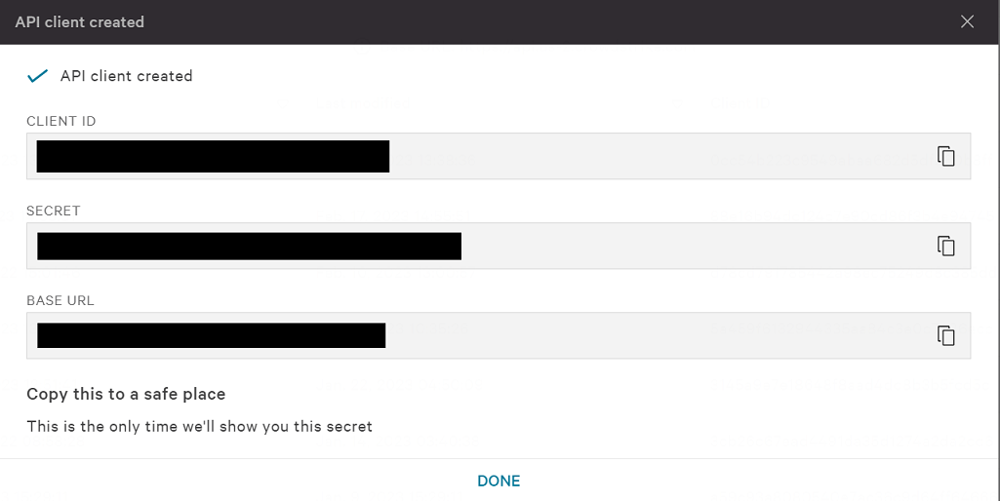
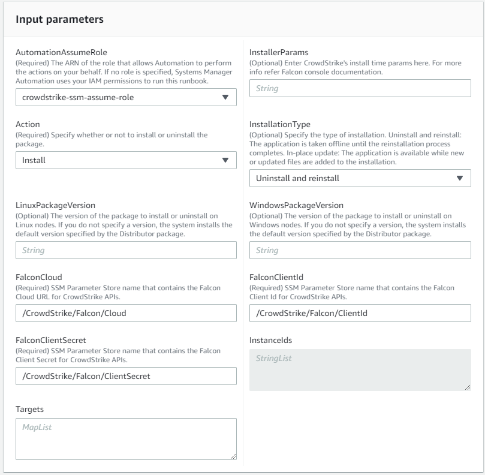

# Official AWS Distributor Package

This deployment guide outlines the steps required to use the published third party distributor package in AWS. This method prevents the need to build your own packages and publish your own SSM automation documents to AWS.

New versions of the Falcon Distributor Package are published to the AWS every time a new version of the Falcon Sensor is released.

## Generate API Keys

The distributor package uses the CrowdStrike API to download the sensor onto the target Host. It is highly recommended that you create a dedicated API client for the distributor package.

1. In the CrowdStrike console, navigate to **Support and resources** > **API Clients & Keys**. Click **Add new API Client**.
2. Add the following api scopes:

    | Scope | Permission | Description |
    | --- | --- | --- |
    | Installation Tokens | *READ* | Allows the distributor to pull installation tokens from the CrowdStrike API. |
    | Sensor Download | *READ* | Allows the distributor to download the sensor from the CrowdStrike API. |

3. Click **Add** to create the API client. The next screen will display the API **CLIENT ID**, **SECRET**, and **BASE URL**. You will need all three for the next step.

    <details><summary>picture</summary>
    <p>

    

    </p>
    </details>

## Create AWS Parameter Store Parameters

The distributor package uses AWS Systems Manager Parameter Store to store the API keys. You can create the parameters in the AWS console or using the AWS CLI.

<details><summary>Using the AWS Console</summary>
<p>

1. In your AWS console, navigate to **AWS Systems Manager** > **Application Management** > **Parameter Store**.
2. Create the following parameters

    | Default Parameter Name | Parameter Value | Parameter Type |
    | --- | --- | --- |
    | /CrowdStrike/Falcon/Cloud | The **BASE URL** from [Generate API Keys](#generate-api-keys). | SecureString |
    | /CrowdStrike/Falcon/ClientId | The **CLIENT ID** from [Generate API Keys](#generate-api-keys). |SecureString |
    | /CrowdStrike/Falcon/ClientSecret | The **SECRET** from [Generate API Keys](#generate-api-keys). | SecureString |
    > **Note:** These are the default parameter names the distributor package looks for. You can use any parameter name you want as long as you override the default values when creating the association in the next step.

</p>
</details>

<details><summary>Using the AWS CLI</summary>
<p>

We can use the `aws ssm put-parameter` command to create the parameters from the CLI. See the [put-parameter documentation](https://docs.aws.amazon.com/cli/latest/reference/ssm/put-parameter.html) for more information.

Create the following parameters

| Default Parameter Name | Parameter Value | Parameter Type |
| --- | --- | --- |
| /CrowdStrike/Falcon/Cloud | The **BASE URL** from [Generate API Keys](#generate-api-keys). | SecureString |
| /CrowdStrike/Falcon/ClientId | The **CLIENT ID** from [Generate API Keys](#generate-api-keys). |SecureString |
| /CrowdStrike/Falcon/ClientSecret | The **SECRET** from [Generate API Keys](#generate-api-keys). | SecureString |
> **Note:** These are the default parameter names the distributor package looks for. You can use any parameter name you want as long as you override the default values when creating the association in the next step.

```bash
aws ssm put-parameter \
    --name "/CrowdStrike/Falcon/ClientId" \
    --type "SecureString" \
    --description "CrowdStrike Falcon API Client ID for the distributor package" \
    --region "us-east-1" \
    --value "CLIENT_ID"
```

```bash 
aws ssm put-parameter \
    --name "/CrowdStrike/Falcon/ClientSecret" \
    --type "SecureString" \
    --description "CrowdStrike Falcon API Secret for the distributor package" \
    --region "us-east-1" \
    --value "SECRET"
```
```bash
aws ssm put-parameter \
    --name "/CrowdStrike/Falcon/Cloud" \
    --type "SecureString" \
    --description "CrowdStrike Falcon API Base URL for the distributor package" \
    --region "us-east-1" \
    --value "BASE_URL"
```

</p>
</details>

## Create AWS Systems Manager Association

The CrowdStrike sensor for windows and linux do not share the same release versions. Because of this there are two separate distributor packages. You will need to create an association for windows and an association for linux.

<details><summary>Using the AWS Console</summary>
<p>

1. In the AWS console, go to **AWS Systems Manager** > **Node Management** > **Distributor** > **Third Party**.
2. Select the package for the operating system you want to deploy.
    <details><summary>picture</summary>
    <p>

    

    </p>
    </details>
3. Under **Document** choose **Default at runtime** for **Document Version** (the default document version will always be the most stable)
4. Under **Execution** choose **Rate Control** 
    <details><summary>picture</summary>
    <p>

    

    </p>
    </details>
5. Under **Targets**, choose the method you want to use to target hosts. For more information on targeting hosts, see [Targeting](https://docs.aws.amazon.com/systems-manager/latest/userguide/running-automations-map-targets.html).
    > **Note:** Whatever method you choose to target your systems with ensure that the targeted systems are running the correct operating system for the distributor package you are using. See [Example Targeting](#Example-Targeting) for an example of targeting systems based on Resource Groups.
    <details><summary>picture</summary>
    <p>

    

    </p>
    </details>
6. Fill in the required parameters. 
    | Parameter Name | Description | Default Value | Required |
    | --- | --- | --- | --- |
    | PackageName | The Distributor package name. For Windows use FalconSensor-Windows, for Linux use FalconSensor-Linux. | **N/a** | Yes |
    | PackageVersion | The version of the package to install. | **N-2** | No |
    | FalconCloud | AWS SSM Parameter store name used to store **BASE URL** [created in the previous step](#create-aws-parameter-store-parameters). | **/CrowdStrike/Falcon/Cloud** | Yes |
    | FalconClientId | AWS SSM Parameter store name used to store **CLIENT ID** [created in the previous step](#create-aws-parameter-store-parameters). | **/CrowdStrike/Falcon/ClientId** | Yes |
    | FalconClientSecret | AWS SSM Parameter store name used to store **SECRET** [created in the previous step](#create-aws-parameter-store-parameters). | **/CrowdStrike/Falcon/ClientSecret** | Yes |
    | AutomationAssumeRole | The ARN of the role that the automation document will assume. | **N/a** | Yes |
    | Action | Whether to install or uninstall | **Install** | No |
    | InstallationType | The installation type. | **Uninstall and reinstall** | No |
    | InstallerParams | The parameters to pass to the installer. | **N/a** | No |

    <details><summary>picture</summary>
    <p>

    

    </p>
    </details>
7. Click **Create Association**.

</p>
</details>

<details><summary>Using the AWS CLI</summary>
<p>

We can use the `aws ssm create-association` command to create the association from the CLI. See the [create-association documentation](https://docs.aws.amazon.com/cli/latest/reference/ssm/create-association.html) for more information.

Here is an example of creating an association using the AWS CLI that targets a Resource Group named `crowdstrike-sensor-deploy-windows`.
```bash
aws ssm create-association \
    --name "CrowdStrike-FalconSensorDeploy" \
    --targets "Key=resource-groups:Name,Values=ssm-crowdstrike-sensor-deploy-windows" \
    --parameters "PackageName=FalconSensor-Windows,AutomationAssumeRole=arn:aws:iam::1111111111:role/crowdstrike-ssm-assume-role" \
    --association-name "CrowdStrike-FalconSensorDeploy-Windows" \
    --region "us-east-1"
``` 

</p>
</details>

## Example Targeting

AWS has a few ways for you to target hosts for an association. See the [Targeting documentation](https://docs.aws.amazon.com/systems-manager/latest/userguide/running-automations-map-targets.html) for more information.

How you target your hosts will depend on your environment and your needs, but since our associations are OS specific you will want to make sure only Windows hosts are being targeted for your windows association and only Linux hosts are being targeted for your linux association.


### Using Resource Groups

Resource Groups allow you to target specific AWS resources based on tags. See the [Resource Groups documentation](https://docs.aws.amazon.com/ARG/latest/userguide/resource-groups.html) for more information.

In this example we are going to use two tags to target our hosts.

| Tag Key | Tag Description | Tag Value |
| --- | --- | --- |
| cs-sensor-deploy | This tag will be used to target hosts that we want to deploy the sensor to. | true |
| os | This tag will be used to target hosts based on their operating system. | windows or linux |

> **Note:** These tags are just an example. You can use whatever tags you want to target your hosts.

<details><summary>Using the AWS Console</summary>
<p>

1. In the AWS console, go to **Resource Groups** > **Resources** > **Create Resource Group**.
2. Under **Group Type** choose **Tag-based**.
3. Under **Grouping Criteria** > **Resource Type** choose **AWS::EC2::Instance**.
5. Under **Grouping Criteria** add the tags you want to use to target your hosts.
6. Under **Group Details** > Enter a **Group Name**. This will be the name of the Resource Group your association will target.
7. Fill in any optional fields you want.

    <details><summary>picture</summary>
    <p>

    

    </p>
    </details>
</p>
</details>

<details><summary>Using the AWS CLI</summary>
<p>

We can use the `aws resource-groups create-group` command to create the Resource Group from the CLI. See the [create-group documentation](https://docs.aws.amazon.com/cli/latest/reference/resource-groups/create-group.html) for more information.

Here is an example of creating a Resource Group using the AWS CLI that uses the tags we defined above.

Creating a Resource Group for Windows hosts
```bash
aws resource-groups create-group \
    --name "ssm-crowdstrike-sensor-deploy-windows" \
    --resource-query '{"Type": "TAG_FILTERS_1_0", "Query": "{\"ResourceTypeFilters\": [\"AWS::EC2::Instance\"], \"TagFilters\": [{\"Key\": \"cs-sensor-deploy\", \"Values\": [\"true\"]}, {\"Key\": \"os\", \"Values\": [\"windows\"]}]}" }' \
    --region "us-east-1"
```

Creating a Resource Group for Linux hosts
```bash
aws resource-groups create-group \
    --name "ssm-crowdstrike-sensor-deploy-linux" \
    --resource-query '{"Type": "TAG_FILTERS_1_0", "Query": "{\"ResourceTypeFilters\": [\"AWS::EC2::Instance\"], \"TagFilters\": [{\"Key\": \"cs-sensor-deploy\", \"Values\": [\"true\"]}, {\"Key\": \"os\", \"Values\": [\"linux\"]}]}" }' \
    --region "us-east-1"
```

</p>
</details>
