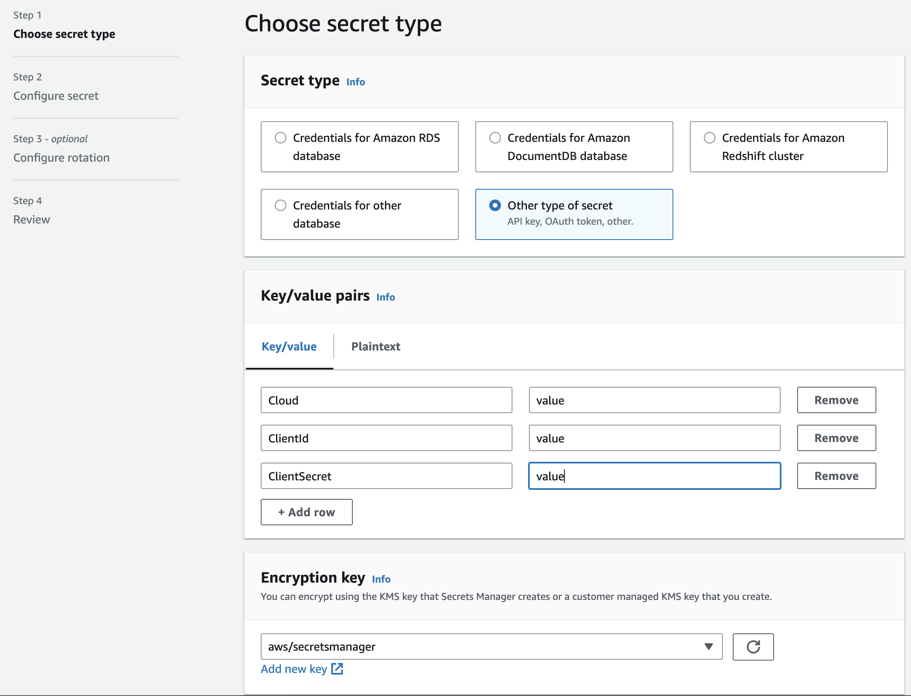
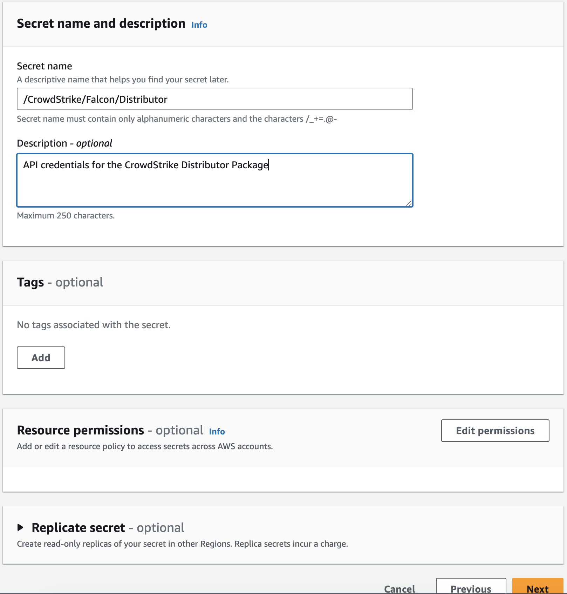
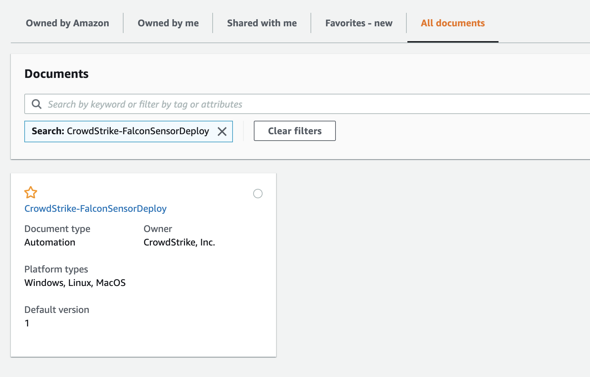

# Official AWS Distributor Package

This deployment guide outlines the steps required to use the published third party distributor package in AWS. This method prevents the need to build your own packages and publish your own SSM automation documents to AWS.

If you have a question checkout the [FAQ](#faq) to see if it has already been answered. If it has not been answered in the FAQ, please open an [issue](https://github.com/CrowdStrike/aws-ssm-distributor/issues/new/choose) and we will happily help.

## Supported Operating Systems

The official distributor package supports the following operating systems:

| Operating System | Architecture |
| --- | --- |
| Amazon Linux 1 | x86_64 |
| Amazon Linux 2 | x86_64, arm64 |
| Amazon Linux 2023 | x86_64, arm64 |
| Red Hat Enterprise Linux 6 | x86_64 |
| Red Hat Enterprise Linux 7 | x86_64 |
| Red Hat Enterprise Linux 8 | x86_64, arm64 |
| Red Hat Enterprise Linux 9 | x86_64 |
| CentOS 6 | x86_64 |
| CentOS 7 | x86_64 |
| CentOS 8 | x86_64, arm64 |
| Oracle Enterprise Linux 6 | x86_64 |
| Oracle Enterprise Linux 7 | x86_64 |
| Oracle Enterprise Linux 8 | x86_64 |
| SUSE Linux Enterprise Server 11 | x86_64 |
| SUSE Linux Enterprise Server 12 | x86_64 |
| SUSE Linux Enterprise Server 15 | x86_64 |
| Ubuntu 16.04 | x86_64 |
| Ubuntu 18.04 | x86_64, arm64 |
| Ubuntu 20.04 | x86_64, arm64 |
| Ubuntu 22.04 | x86_64, arm64 |
| Debian 9 | x86_64 |
| Debian 10 | x86_64 |
| Debian 11 | x86_64
| All Windows Versions supported by the CrowdStrike Sensor | x86_64 |

> Note: For supported Windows versions, check the CrowdStrike documentation.

## Setting up Systems Manager
Distributor is a feature of AWS Systems Manager. In order to use the distributor package, you must first setup AWS Systems Manager. See the [AWS documentation](https://docs.aws.amazon.com/systems-manager/latest/userguide/systems-manager-setting-up.html) for more information.

A ssm agent version of `2.3.1550.0` or greater is required.

## Generate API Keys

The distributor package uses the CrowdStrike API to download the sensor onto the target instance. It is highly recommended that you create a dedicated API client for the distributor package.

1. In the CrowdStrike console, navigate to **Support and resources** > **API Clients & Keys**. Click **Add new API Client**.
2. Add the following api scopes:

    | Scope | Permission | Description |
    | --- | --- | --- |
    | Installation Tokens | *READ* | Allows the distributor to pull installation tokens from the CrowdStrike API. |
    | Sensor Download | *READ* | Allows the distributor to download the sensor from the CrowdStrike API. |

3. Click **Add** to create the API client. The next screen will display the API **CLIENT ID**, **SECRET**, and **BASE URL**. You will need all three for the next step.

    <details><summary>picture</summary>
    <p>

    

    </p>
    </details>

> Note: This page is only shown once. Make sure you copy **CLIENT ID**, **SECRET**, and **BASE URL** to a secure location.

## Store API Keys in AWS

We support both AWS Secrets Manager and AWS Parameter Store as secret backends. Choose which one fits your environment the best.

Generally Secrets Manager will be better for larger deployments because Secrets Manager has cross region replication and can be created by CloudFormation. This makes deploying a lot easier than Parameter Store.

The benefit of Parameter Store is there is no cost for basic parameters.

<details><summary>Using AWS Secrets Manager</summary>

To use Secrets Manager as your secret backend, you must choose `SecretsManager` as the value for the `SecretStorageMethod` parameter when running the automation document: `CrowdStrike-FalconSensorDeploy`. There will be more information on this in the following sections.

By default, the automation document looks for a secret named `/CrowdStrike/Falcon/Distributor` with the following key/value pairs:

| Key | Value |
| --- | --- |
| ClientId | The **CLIENT ID** from [Generate API Keys](#generate-api-keys). |
| ClientSecret | The **SECRET** from [Generate API Keys](#generate-api-keys). |
| Cloud | The **BASE URL** from [Generate API Keys](#generate-api-keys). |

You can use any secret name you like, as long as you pass in the secret name when running the automation document. The keys must match the table above.

<details><summary>Using the AWS Console</summary>

1. In your AWS console, navigate to **AWS Secrets Manager** > **Secrets**.
2. Click **Store a new secret**.
3. Choose **Other type of secret**.
4. Fill in the secret key/value pairs from the table above.
    <details><summary>picture</summary>
    <p>

    

    </p>
    </details>
5. Fill in the optional fields if you want. Click **Next**.
6. Give the secret a name. The default name the distributor package looks for is `/CrowdStrike/Falcon/Distributor`. You can use any name you want as long as you override the default value for `SecretsManagerSecretName` when running the automation document.
    <details><summary>picture</summary>
    <p>

    

    </p>
    </details>
7. Fill in the optional fields if you want. Click **Next**. 
8. Configure the optional rotation settings if you want. Click **Next**.
9.  Review and click **Store**.
</details>

<details><summary>Using the AWS CLI</summary>

We can use the `aws secretsmanager create-secret` command to create the secret from the cli. See the [create-secret documentation](https://docs.aws.amazon.com/cli/latest/reference/secretsmanager/create-secret.html) for more information.  

The following command will create a secret named `/CrowdStrike/Falcon/Distributor` with the key/value pairs from the table above.

```bash
aws secretsmanager create-secret \
    --name /CrowdStrike/Falcon/Distributor \
    --secret-string '{"ClientId":"<CLIENT_ID>","ClientSecret":"<CLIENT_SECRET>","Cloud":"<BASE_URL>"}'
```

</details>

---

</details>


<details><summary>Using AWS Parameter Store</summary>
To use Parameter Store as your secret backend, you must choose `ParameterStore` as the value for the `SecretStorageMethod` parameter when running the automation document: `CrowdStrike-FalconSensorDeploy`. There will be more information on this in the following sections.

You can create the parameters in the AWS console or using the AWS CLI.

The following parameters must be created:

| Default Parameter Name | Parameter Value | Parameter Type |
| --- | --- | --- |
| /CrowdStrike/Falcon/Cloud | The **BASE URL** from [Generate API Keys](#generate-api-keys). | SecureString |
| /CrowdStrike/Falcon/ClientId | The **CLIENT ID** from [Generate API Keys](#generate-api-keys). |SecureString |
| /CrowdStrike/Falcon/ClientSecret | The **SECRET** from [Generate API Keys](#generate-api-keys). | SecureString |
> **Note:** These are the default parameter names the distributor package looks for. You can use any parameter name you want as long as you override the default values when creating the association in the next step.

<details><summary>Using the AWS Console</summary>
<p>

1. In your AWS console, navigate to **AWS Systems Manager** > **Application Management** > **Parameter Store**.
2. Create the parameters mentioned in the table above.

</p>
</details>

<details><summary>Using the AWS CLI</summary>
<p>

We can use the `aws ssm put-parameter` command to create the parameters from the CLI. See the [put-parameter documentation](https://docs.aws.amazon.com/cli/latest/reference/ssm/put-parameter.html) for more information.

```bash
aws ssm put-parameter \
    --name "/CrowdStrike/Falcon/ClientId" \
    --type "SecureString" \
    --description "CrowdStrike Falcon API Client ID for the distributor package" \
    --region "us-east-1" \
    --value "CLIENT_ID"
```

```bash 
aws ssm put-parameter \
    --name "/CrowdStrike/Falcon/ClientSecret" \
    --type "SecureString" \
    --description "CrowdStrike Falcon API Secret for the distributor package" \
    --region "us-east-1" \
    --value "SECRET"
```
```bash
aws ssm put-parameter \
    --name "/CrowdStrike/Falcon/Cloud" \
    --type "SecureString" \
    --description "CrowdStrike Falcon API Base URL for the distributor package" \
    --region "us-east-1" \
    --value "BASE_URL"
```

</p>
</details>
</details>


## Create AWS IAM Role

The distributor package uses an AWS IAM role to assume when running the AWS Systems Manager Automation document. The role is used for the following:

- Read AWS Systems Manager Parameter Store parameters (If using Parameter Store as the secret backend)
- Read AWS Secrets Manager secrets (If using Secrets Manager as the secret backend)
- Describe AWS EC2 instances to determine the platform
- Run the `AWS-ConfigureAWSPackage` document to install the sensor

<details><summary>Using CloudFormation</summary>

A CloudFormation template with the required permissions is available under the [cloudformation](./cloudformation) directory.

You can use the below command to download the template and create the stack.

```bash
curl -s -o ./iam-role.yaml "https://raw.githubusercontent.com/crowdstrike/aws-ssm-distributor/main/official-package/cloudformation/iam-role.yaml" \
&& aws cloudformation create-stack \
  --stack-name crowdstrike-distributor-deploy-role \
  --template-body file://iam-role.yaml \
  --capabilities CAPABILITY_NAMED_IAM \
  --parameters ParameterKey=SecretStorageMethod,ParameterValue=ParameterStore
```

If you want to use Secrets Manager as the secret backend, replace `ParameterStore` with `SecretsManager`.

```bash

</details>

<details> <summary>Using the AWS CLI</summary>

We can use the `aws iam create-role` command to create the role from the CLI. See the [create-role documentation](https://docs.aws.amazon.com/cli/latest/reference/iam/create-role.html) for more information.

```bash
aws iam create-role \
    --role-name "crowdstrike-distributor-deploy-role" \
    --assume-role-policy-document '{
        "Version": "2012-10-17",
        "Statement": [
            {
                "Effect": "Allow",
                "Principal": {
                    "Service": "ssm.amazonaws.com"
                },
                "Action": "sts:AssumeRole"
            }
        ]
    }' \
    --description "Role for running SSM automation documents" \
    --max-session-duration 3600
```

Then we need to attach the required policies to the role. See the [attach-role-policy documentation](https://docs.aws.amazon.com/cli/latest/reference/iam/attach-role-policy.html) for more information.

```bash
aws iam attach-role-policy \
    --role-name crowdstrike-distributor-deploy-role \
    --policy-arn arn:aws:iam::aws:policy/service-role/AmazonSSMAutomationRole
```

If you want to use Secrets Manager as the secret backend, you must also attach a policy that allows the role to read secrets from Secrets Manager. If you do not want to create your own policy you can use the following:

```bash
aws iam attach-role-policy \
    --role-name crowdstrike-distributor-deploy-role \
    --policy-arn arn:aws:iam::aws:policy/SecretsManagerReadWrite
```
</details>

## Deploying the CrowdStrike Falcon Sensor

Once you've completed the above steps you are ready to start deploying the CrowdStrike Falcon Sensor on your SSM manged nodes. You will not execute the distributor package directly. Instead, you will use the published automation document `CrowdStrike-FalconSensorDeploy`.

The automation document generates the necessary parameters that will be passed to the distributor package. You have various options to execute the automation document. Refer to the [AWS documentation](https://docs.aws.amazon.com/systems-manager/latest/userguide/running-automations.html) for further details on different methods to execute this automation document.

The automation document has the following parameters:

| Parameter Name | Description | Default Value | Required |
| --- | --- | --- | --- |
| InstanceIds| The instance IDs of the instances where the sensor will be installed. | **N/a** | Yes |
| AutomationAssumeRole | The ARN of the role that the automation document will assume. | **N/a** | Yes |
| SecretStorageMethod | The secret backend to use. Can be **ParameterStore** or **SecretsManager** | **ParameterStore** | Yes |
| SecretsManagerSecretName | The name of the secret in Secrets Manager. | **/CrowdStrike/Falcon/Distributor** | Yes, if `SecretStorageMethod` is **SecretsManager** |
| FalconCloud | AWS SSM Parameter store name used to store **BASE URL** [created in the previous step](#create-aws-parameter-store-parameters). | **/CrowdStrike/Falcon/Cloud** | Yes, if `SecretStorageMethod` is **ParameterStore** |
| FalconClientId | AWS SSM Parameter store name used to store **CLIENT ID** [created in the previous step](#create-aws-parameter-store-parameters). | **/CrowdStrike/Falcon/ClientId** | Yes, if `SecretStorageMethod` is **ParameterStore** |
| FalconClientSecret | AWS SSM Parameter store name used to store **SECRET** [created in the previous step](#create-aws-parameter-store-parameters). | **/CrowdStrike/Falcon/ClientSecret** | Yes, if `SecretStorageMethod` is **ParameterStore** |
| Action | Whether to install or uninstall | **Install** | No |
| LinuxPackageVersion | The version of the Linux package to install. Example `7.04.17600` installs `N-1` version if no version is provided | **N/a** | No |
| LinuxInstallerParams | The parameters to pass at install time on Linux nodes. | **N/a** | No |
| WindowsPackageVersion | The version of the Windows package to install. Example `7.04.17600` installs `N-1` version if no version is provided. | **N/a** | No |
| WindowsInstallerParams | The parameters to pass at install time on Windows nodes.| **N/a** | No |

### Example: Using Systems Manager Associations

Using State Manager associations, we can create a single association that will do the following:

- Install the CrowdStrike Falcon sensor on all instances (Windows and Linux) within the region
- Run on a schedule to ensure the sensor is always present on every instance
- Install the sensor on newly created machines automatically

For more information on State Manager, see the [AWS documentation](https://docs.aws.amazon.com/systems-manager/latest/userguide/sysman-state-about.html).

> **Note:** There are two distributor packages one for Windows and Linux. This was due to the way packages were versioned at launch. Starting version v1.0.0 and later there is no difference between the two packages. You can choose either package and it will work on both Windows and Linux. In the future this may be replaced with a single package.

<details><summary>Using the AWS Console</summary>
<p>

1. In the AWS console, go to **AWS Systems Manager** > **Node Management** > **Distributor** > **Third Party**.
2. Select either package (It does not matter, see note above).
    <details><summary>picture</summary>
    <p>

    

    </p>
    </details>
3. Click `Install on a schedule`. This will redirect you to the `Create Association` page with the `CrowdStrike-FalconSensorDeploy` document preselected.
    > **Note**: This is the same as going to **AWS Systems Manager** > **Node Management** > **State Manager** > **Create Association** and selecting the `CrowdStrike-FalconSensorDeploy` document.
4. Under **Document** choose **Default at runtime** for **Document Version** (the default document version will always be the most stable)
5. Under **Execution** choose **Rate Control** 
    <details><summary>picture</summary>
    <p>

    

    </p>
    </details>
6. Under **Targets** > **Parameter** choose **InstanceIds**.
    <details><summary>picture</summary>
    <p>

    

    </p>
    </details>

7. Under **Targets** > **Targets** choose the method you want to use to target instances. In our example we are going to target all instances. For more information on targeting instances, see [Targeting](https://docs.aws.amazon.com/systems-manager/latest/userguide/running-automations-map-targets.html).
    <details><summary>picture</summary>
    <p>

    

    </p>
    </details>
8. Fill in the required parameters. For more information on each parameter, reference the parameters table in the [Deploying the CrowdStrike Falcon Sensor](#deploying-the-crowdstrike-falcon-sensor) section.

    <details><summary>picture</summary>
    <p>

    

    </p>
    </details>
9.  Click **Create Association**.

</p>
</details>

<details><summary>Using the AWS CLI</summary>
<p>

We can use the `aws ssm create-association` command to create the association from the CLI. See the [create-association documentation](https://docs.aws.amazon.com/cli/latest/reference/ssm/create-association.html) for more information.

Here is an example of creating an association using the AWS CLI that targets all instances.
```bash
aws ssm create-association \
    --name "CrowdStrike-FalconSensorDeploy" \
    --targets "Key=InstanceIds,Values=*" \
    --parameters "AutomationAssumeRole=arn:aws:iam::111111111:role/crowdstrike-ssm-assume-role" \
    --association-name "crowdstrike-falcon-sensor-deploy" \
    --automation-target-parameter-name "InstanceIds" \
    --region "us-east-1"
``` 

For more information on each parameter, reference the parameters table in the [Deploying the CrowdStrike Falcon Sensor](#deploying-the-crowdstrike-falcon-sensor) section.

</p>
</details>

## FAQ

### How do I upgrade/downgrade the sensor?

CrowdStrike Falcon Sensor upgrades and downgrades should be handled by update policies. The distributor package will not upgrade or downgrade the sensor. The distributor package should be used to install the sensor and then allow update policies to manage the sensor version.

### What AWS regions are supported?
<details><summary>List of supported regions</summary>

- af-south-1
- ap-east-1
- ap-northeast-1
- ap-northeast-2
- ap-south-1
- ap-southeast-1
- ap-southeast-2
- ca-central-1
- eu-central-1
- eu-north-1
- eu-south-1
- eu-west-1
- eu-west-2
- eu-west-3
- me-south-1
- sa-east-1
- us-east-1
- us-east-2
- us-west-1
- us-west-2

If a region you need is not supported you can still use the [custom-binary-package](../custom-binary-package) or [custom-api-package](../custom-api-package) to install the sensor.

If you would like to request support for a region, please reach out to your CrowdStrike representative.
</details>

### Where is the `CrowdStrike-FalconSensorDeploy` automation document?

The `CrowdStrike-FalconSensorDeploy` automation document can be found in the AWS console under **AWS Systems Manager** > **Documents** > **All documents** > search for `CrowdStrike-FalconSensorDeploy`.

<details><summary>picture</summary>



</details>

### Why do some automation steps stay pending?

The `CrowdStrike-FalconSensorDeploy` automation document contains conditional actions that will only run if certain conditions are met. If a steps conditions are not met they will stay in a `Pending` state. You can read more about [automation statuses here](https://docs.aws.amazon.com/systems-manager/latest/userguide/automation-statuses.html).