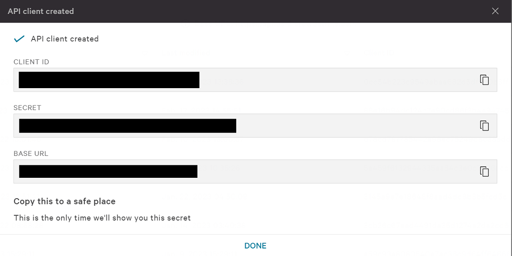
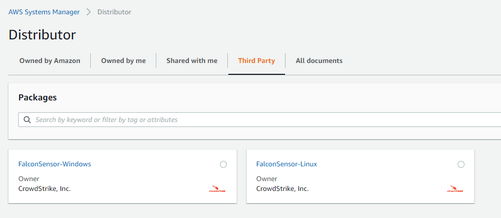
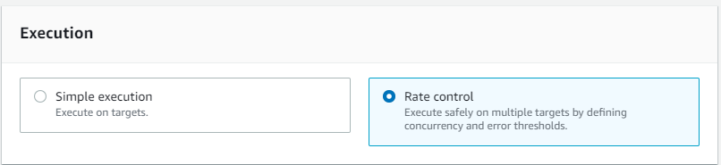
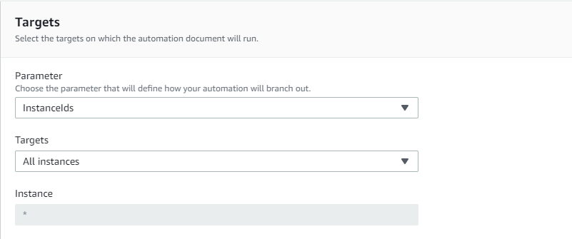
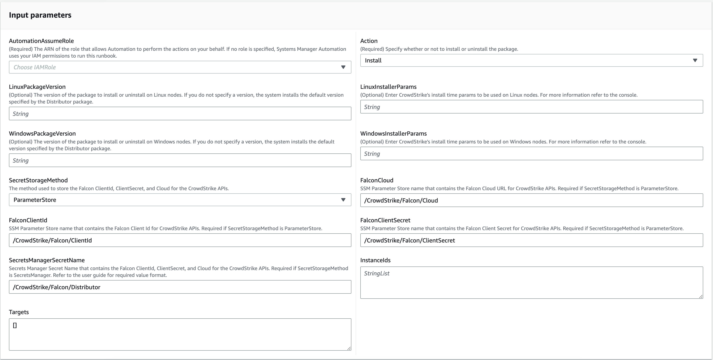

# Official AWS Distributor Package

This deployment guide outlines the steps required to use the published third party distributor package in AWS. This method prevents the need to build your own packages and publish your own SSM automation documents to AWS.

New versions of the Falcon Distributor Package are published to AWS every time a new version of the Falcon Sensor is released.

## Generate API Keys

The distributor package uses the CrowdStrike API to download the sensor onto the target instance. It is highly recommended that you create a dedicated API client for the distributor package.

1. In the CrowdStrike console, navigate to **Support and resources** > **API Clients & Keys**. Click **Add new API Client**.
2. Add the following api scopes:

    | Scope | Permission | Description |
    | --- | --- | --- |
    | Installation Tokens | *READ* | Allows the distributor to pull installation tokens from the CrowdStrike API. |
    | Sensor Download | *READ* | Allows the distributor to download the sensor from the CrowdStrike API. |

3. Click **Add** to create the API client. The next screen will display the API **CLIENT ID**, **SECRET**, and **BASE URL**. You will need all three for the next step.

    <details><summary>picture</summary>
    <p>

    

    </p>
    </details>

> Note: This page is only shown once. Make sure you copy **CLIENT ID**, **SECRET**, and **BASE URL** to a secure location.

## Create AWS Parameter Store Parameters

The distributor package uses AWS Systems Manager Parameter Store to store the API keys. You can create the parameters in the AWS console or using the AWS CLI.

The following parameters must be created:

| Default Parameter Name | Parameter Value | Parameter Type |
| --- | --- | --- |
| /CrowdStrike/Falcon/Cloud | The **BASE URL** from [Generate API Keys](#generate-api-keys). | SecureString |
| /CrowdStrike/Falcon/ClientId | The **CLIENT ID** from [Generate API Keys](#generate-api-keys). |SecureString |
| /CrowdStrike/Falcon/ClientSecret | The **SECRET** from [Generate API Keys](#generate-api-keys). | SecureString |
> **Note:** These are the default parameter names the distributor package looks for. You can use any parameter name you want as long as you override the default values when creating the association in the next step.

<details><summary>Using the AWS Console</summary>
<p>

1. In your AWS console, navigate to **AWS Systems Manager** > **Application Management** > **Parameter Store**.
2. Create the parameters mentioned in the table above.

</p>
</details>

<details><summary>Using the AWS CLI</summary>
<p>

We can use the `aws ssm put-parameter` command to create the parameters from the CLI. See the [put-parameter documentation](https://docs.aws.amazon.com/cli/latest/reference/ssm/put-parameter.html) for more information.

```bash
aws ssm put-parameter \
    --name "/CrowdStrike/Falcon/ClientId" \
    --type "SecureString" \
    --description "CrowdStrike Falcon API Client ID for the distributor package" \
    --region "us-east-1" \
    --value "CLIENT_ID"
```

```bash 
aws ssm put-parameter \
    --name "/CrowdStrike/Falcon/ClientSecret" \
    --type "SecureString" \
    --description "CrowdStrike Falcon API Secret for the distributor package" \
    --region "us-east-1" \
    --value "SECRET"
```
```bash
aws ssm put-parameter \
    --name "/CrowdStrike/Falcon/Cloud" \
    --type "SecureString" \
    --description "CrowdStrike Falcon API Base URL for the distributor package" \
    --region "us-east-1" \
    --value "BASE_URL"
```

</p>
</details>

## Create AWS IAM Role

The distributor package uses an AWS IAM role to assume when running the AWS Systems Manager Automation document. The role is used for the following:

- Create/Read/Update AWS Systems Manager Parameter Store parameters
- Describe AWS EC2 instances to determine the platform
- Run the `AWS-ConfigureAWSPackage` document to install the sensor

<details><summary>Using CloudFormation</summary>

A CloudFormation template with the required permissions is available under the [cloudformation](./cloudformation) directory.

You can use the below command to download the template and create the stack.

```bash
curl -s -o ./iam-role.yaml "https://raw.githubusercontent.com/crowdstrike/aws-ssm-distributor/main/official-package/cloudformation/iam-role.yaml" \
&& aws cloudformation create-stack \
  --stack-name crowdstrike-distributor-deploy-role \
  --template-body file://iam-role.yaml \
  --capabilities CAPABILITY_NAMED_IAM
```
</details>

<details>> <summary>Using the AWS CLI</summary>

We can use the `aws iam create-role` command to create the role from the CLI. See the [create-role documentation](https://docs.aws.amazon.com/cli/latest/reference/iam/create-role.html) for more information.

```bash
aws iam create-role \
    --role-name "crowdstrike-distributor-deploy-role" \
    --assume-role-policy-document '{
        "Version": "2012-10-17",
        "Statement": [
            {
                "Effect": "Allow",
                "Principal": {
                    "Service": "ssm.amazonaws.com"
                },
                "Action": "sts:AssumeRole"
            }
        ]
    }' \
    --description "Role for running SSM automation documents" \
    --max-session-duration 3600 \
    --permissions-boundary "arn:aws:iam::aws:policy/service-role/AmazonSSMAutomationRole"
```
</details>


## Create AWS Systems Manager Association

Using State Manager associations, we can create a single association that will install the sensor on all of our target instances. The association will use the AWS Systems Manager Distributor package to install the sensor. For more information on State Manager, see the [AWS documentation](https://docs.aws.amazon.com/systems-manager/latest/userguide/sysman-state-about.html).

> **Note:** There are two distributor packages available because the falcon sensor for Windows and Linux have a different version number. You will be able to target a specific version for each OS in the association parameters.

<details><summary>Using the AWS Console</summary>
<p>

1. In the AWS console, go to **AWS Systems Manager** > **Node Management** > **Distributor** > **Third Party**.
2. Select either package.
    <details><summary>picture</summary>
    <p>

    

    </p>
    </details>
3. Under **Document** choose **Default at runtime** for **Document Version** (the default document version will always be the most stable)
4. Under **Execution** choose **Rate Control** 
    <details><summary>picture</summary>
    <p>

    

    </p>
    </details>
5. Under **Targets** > **Parameter** choose **InstanceIds**.
6. Under **Targets** > **Targets** choose the method you want to use to target instances. In our example we are going to target all instances. For more information on targeting instances, see [Targeting](https://docs.aws.amazon.com/systems-manager/latest/userguide/running-automations-map-targets.html).
    <details><summary>picture</summary>
    <p>

    

    </p>
    </details>
7. Fill in the required parameters. 
    | Parameter Name | Description | Default Value | Required |
    | --- | --- | --- | --- |
    | AutomationAssumeRole | The ARN of the role that the automation document will assume. | **N/a** | Yes |
    | LinuxPackageVersion | The Linux version of the package to install. | **N-2** | No |
    | WindowsPackageVersion | The Windows version of the package to install. | **N-2** | No |
    | FalconCloud | AWS SSM Parameter store name used to store **BASE URL** [created in the previous step](#create-aws-parameter-store-parameters). | **/CrowdStrike/Falcon/Cloud** | Yes |
    | FalconClientId | AWS SSM Parameter store name used to store **CLIENT ID** [created in the previous step](#create-aws-parameter-store-parameters). | **/CrowdStrike/Falcon/ClientId** | Yes |
    | FalconClientSecret | AWS SSM Parameter store name used to store **SECRET** [created in the previous step](#create-aws-parameter-store-parameters). | **/CrowdStrike/Falcon/ClientSecret** | Yes |
    | Action | Whether to install or uninstall | **Install** | No |
    | InstallationType | The installation type. | **Uninstall and reinstall** | No |
    | InstallerParams | The parameters to pass to the installer. | **N/a** | No |

    <details><summary>picture</summary>
    <p>

    

    </p>
    </details>
8. Click **Create Association**.

</p>
</details>

<details><summary>Using the AWS CLI</summary>
<p>

We can use the `aws ssm create-association` command to create the association from the CLI. See the [create-association documentation](https://docs.aws.amazon.com/cli/latest/reference/ssm/create-association.html) for more information.

Here is an example of creating an association using the AWS CLI that targets all instances.
```bash
aws ssm create-association \
    --name "CrowdStrike-FalconSensorDeploy" \
    --targets "Key=InstanceIds,Values=*" \
    --parameters "AutomationAssumeRole=arn:aws:iam::111111111:role/crowdstrike-ssm-assume-role" \
    --association-name "crowdstrike-falcon-sensor-deploy" \
    --automation-target-parameter-name "InstanceIds" \
    --region "us-east-1"
``` 

</p>
</details>