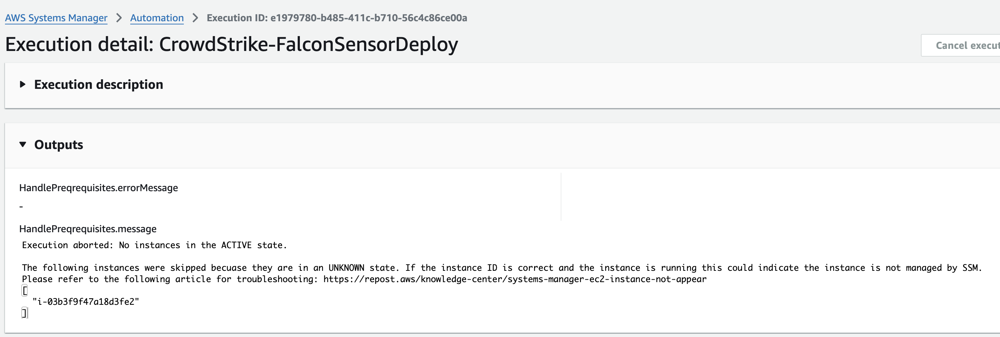
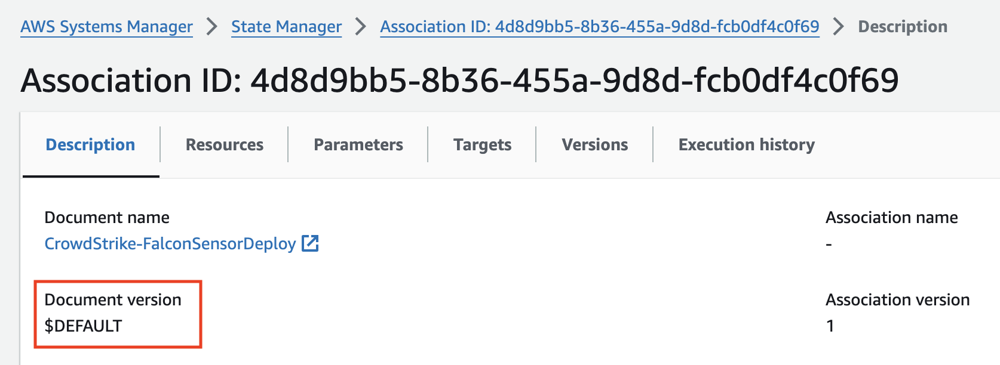

# `Consolidated Package` Migration Guide

Migrating to the consolidated package is a simple process. For the vast majority of customers if you are using our recommended deployment method of State Manager and are targeting the `Default at runtime` version of the automation document you are already migrated.

- **No Breaking Changes** - The new consolidated package and automation document are backwards compatable for existing deployments.

## Benefits

- **Ubuntu 24.04 x86_64, arm64 Support** - The consolidated package adds support for Ubuntu 24.04 x86_64 & arm64.
- **Improved Error Handling** - Added automation level outputs that will provide information about what happened during the run and link to any relevant documentation to help resolve issues.

- **Fewer Automation Document Steps (Reduced Cost)** - When you use an automation document in SSM you are charged per automation step. The consolidated package went from 7 to 4 steps. Reducing the cost of using the Official Distributor package.
- **Improved Execution Logic (Reduced Cost)** - Reducing the number of steps meant we also needed to handle some fail cases sooner. Another cost when running automation documents is the time it takes for the `executeScript` action to run. By handling these `fail` cases sooner in many cases we are reducing the run time of the action & preventing future steps from executing. Lowering the cost even more.
- **Single Package** - A common question we recieved from customers was "Why are there two packages?". There were requirements & limitations around SSM at the time of release that required two packages. We've been able to find answers to these limitations & made the consolidated package possible.

## Migration Steps

### State Manager

Migrating is easy. All you need to do is make sure you are using version `3` or greater of the `CrowdStrike-FalconSensorDeply` automation document. Version `3` of the automation document will automatically use the consolidated package.

Go to each association in State Manager that uses the `CrowdStrike-FalconSensorDeploy` automation document and ensure the `Document version` is set to `$DEFAULT`, `3`, or `$LATEST`

If the `Document version` shows one of those values you are already migrated and there is nothing you need to do. If you are using something other than `$DEFAULT` It is highly recommended you choose `Default at runtime` which will show as `$DEFAULT` as the `Document version` in the console. This will ensure you are always running the latest and most stable version of the automation document. Customers who were using the `$DEFAULT` would have already been migrated.

### Automation Document

If you are calling the automation documention directly without using State Manager you will just need to ensure you are consuming version `3` or later.

### Distributor Package

If you are consuming the distributor package directly bypassing the automation document. You will need to start using the consolidated package `FalconSensor-CrowdStrike` instead of the `FalconSensor-Windows` & `FalconSensor-Linux` packages.

The install arguments for windows and linux changed. The rest of the `additionalArguments` remain the same.

| OS | Old Package | New Package |
| --- | --- | --- |
| Windows | `SSM_CS_INSTALLPARAMS` | `SSM_CS_WINDOWS_INSTALLPARAMS` |
| Linux | `SSM_CS_INSTALLPARAMS` | `SSM_CS_LINUX_INSTALLPARAMS` |
| Windows | `SSM_CS_WINDOWS_VERSION` | `SSM_CS_VERSION` |
| Linux | `SSM_CS_LINUX_VERSION` | `SSM_CS_VERSION` |
